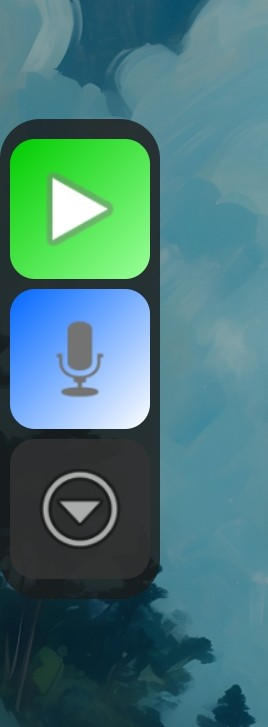
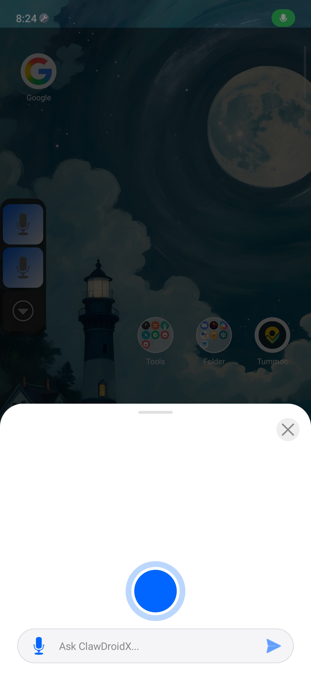
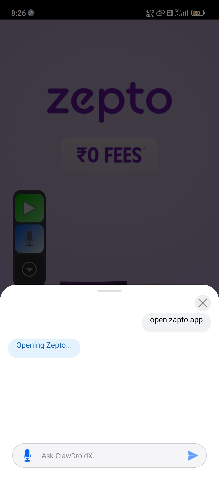

# ClawDroidX — The Native AI Agent for Android

> **Your Android — on steroids.** 🔋📲🚀

ClawDroidX is a native agentic framework that navigates mobile applications locally and securely. By leveraging Android's accessibility layer and on-device semantic pruning, ClawDroidX turns natural language intent into autonomous OS-level action.

## 🕹️ Interaction Model: Floating Mic

Forget opening the app to issue commands. ClawDroidX provides a **floating overlay icon** that stays with you across all screens.

### How it Works:
- **Voice-First Overlay**: Click the floating mic icon. A transparent interface appears, showing a real-time transcript of your intent and the Agent's planned action.
  
- **Intelligent Launching**: No more precise typing. Ask for "zapto" or "ubar" — the agent intelligently scans your installed apps and launches the correct target (like Zepto or Uber) using semantic fuzzy matching.
  
- **Phase 1 Precision**: For the best results during our initial beta, we recommend being precise with your commands. We are rapidly evolving toward full indirect intent recognition.

## 🚀 Public Beta (v0.1.0-beta)

We have officially launched the **ClawDroidX Public Beta**. Experience the future of mobile agency with our secure, privacy-first orchestration engine.

- **[Download the Public Beta APK](https://github.com/nareshis21/ClawDroidX-landing/releases/download/v0.1.0-beta/ClawDroidX-v0.1.0-beta.apk)**
- **[View the Live Showcase](https://github.com/nareshis21/ClawDroidX-landing)** (optimized for 100% volume interaction)

## 🧠 Intelligence Roadmap: From Linear to Adaptive

ClawDroidX is currently in **Phase 1: Deterministic Mastery**. We focus on high-reliability, linear task execution where your natural language intent is translated into a precise native workflow.

- **Phase 1 (Current)**: **Deterministic Replay & Mapping**. The agent learns the pixel-perfect path for your specific goals (Uber, System Toggles, etc.) and replays them with zero-token latency.
- **Phase 2 (Coming Soon)**: **Self-Healing Macros**. Automatically adapting to UI layout changes and minor app updates without requiring a new recording.
- **Vision**: **Cross-App Orchestration**. We are architecting the ability to chain intents across multiple applications (e.g., Transferring data from Email to Calendar), currently in active research.

## 🎯 Use Case Library (v0.1.0 Beta)

### 🚗 Travel & Logistics (Linear)
1. **Uber/Lyft**: Direct ride discovery and booking handover.
2. **Maps**: Instant navigation lookup from text intent.
3. **Food**: "Re-order my last meal" via native delivery apps.

### 💳 Finance & Payments (High Reliability)
4. **PIN Automation**: Secure, zero-latency local PIN entry for Paytm/PhonePe.
5. **Balance Check**: Direct navigation to balance screens in banking apps.
6. **Bill Pay**: Rapid execution of monthly utility triggers.

### ⚙️ OS & Productivity (Direct Control)
7. **Hardware Mastering**: Visual-intent brightness and volume control.
8. **System Toggles**: Rapid execution of Flashlight, DND, and Airplane modes.
9. **Macro Replay**: ClawDroidX learns your repeated success paths and replays them locally to eliminate wait times.

### 📱 Social & Communication
13. **Cross-Post**: Share a draft to Twitter, LinkedIn, and Instagram simultaneously.
14. **Smart Reply**: Generate and paste contextual replies into WhatsApp/Telegram.
15. **Lead Scraping**: Extract contact info from LinkedIn and add to Contacts.
16. **Media Management**: "Clean up blurry photos from my gallery" locally.

### 🛠️ Personal Automation
17. **Morning Routine**: Set alarm, check weather, and open Spotify in one command.
18. **Health**: Log water intake or steps into fitness trackers via voice.
19. **Smart Home**: Trigger Home Assistant/Google Home routines natively.
20. **Job Search**: Automate "Easy Apply" flows on LinkedIn/Indeed based on your resume.

## ✨ Key Technical Pillars

- **Native Orchestration**: Operates directly on the Android Accessibility layer—no ADB or external setups required.
- **Local UI Pruning**: Scans 300+ UI nodes locally (via ONNX Runtime) to distill the tree into the top 30 most relevant targets, keeping sensitive data off the cloud.
- **Privacy-First Security**: PIN entry, biometric triggers, and sensitive app navigations are handled entirely within the device's secure enclave.
- **Viewport-Aware Showcase**: High-performance landing page featuring "Silent-Start" autoplay with instant 100% volume unlock upon user gesture.

## 🛠️ Project Foundation

This repository contains the **ClawDroidX Marketing & Showcase Foundation**, built with:
- **Core**: React + TypeScript + Vite
- **Animations**: Framer Motion (Scroll Reveal Engine)
- **Video Engine**: YouTube IFrame API (Custom Playback Logic)
- **Icons**: Lucide React

## 📲 Getting Started

1. **Prerequisites**: Android 10+ (Recommended).
2. **Installation**: Download the latest `.apk` from the [Releases](https://github.com/nareshis21/ClawDroidX-landing/releases) page.
3. **Permissions**: Enable **Accessibility Services** and **Modify System Settings** to allow the agent to orchestrate natively.

## 🤝 Join the Journey

ClawDroidX is an experimental research project. We value your feedback to help us squash bugs and evolve the native mobile agent ecosystem.

- **Email**: [nareshlahajal@gmail.com](mailto:nareshlahajal@gmail.com)
- **LinkedIn**: [Naresh Kumar Lahajal](https://www.linkedin.com/in/naresh-kumar-lahajal-a50383252/)

---
*Establishing the foundation for native mobile agent orchestration. 🕺📲🔊🚀✨*
